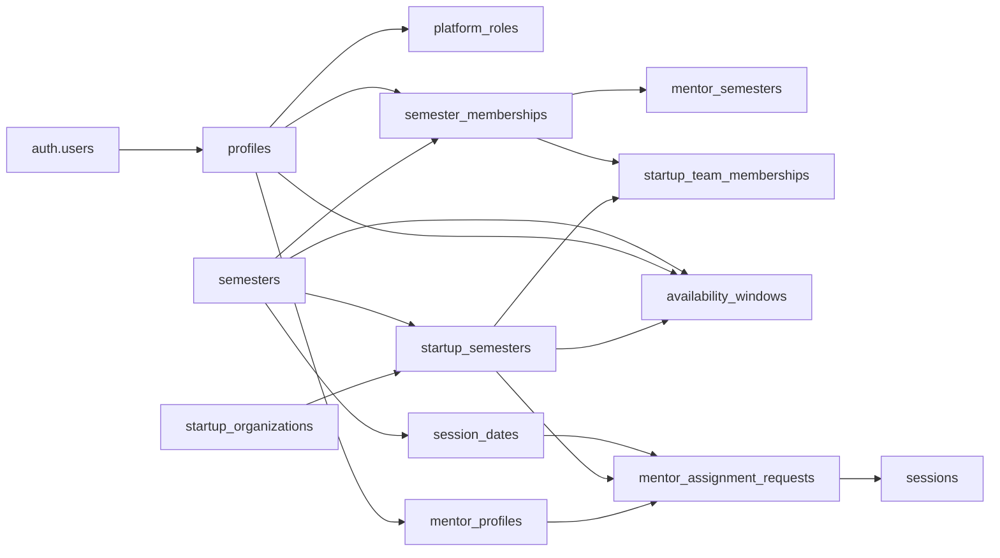
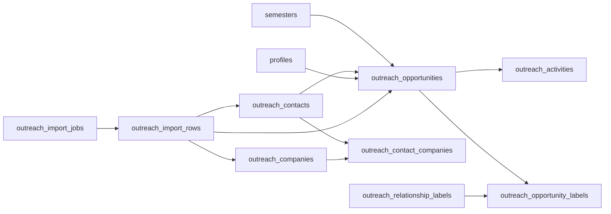

# Almaworks database map

Generated from the running local Supabase database on 2026-08-30. This documents all application-owned tables in the `public` schema. Supabase-managed schemas such as `auth`, `storage`, and `realtime` are intentionally omitted, except where a public table points to `auth.users`.

## How to read this map

- `-> table.column` marks a foreign-key relationship.
- `PK` marks a primary key. A table with several `PK` columns has a composite primary key.
- `[]` means an array; `jsonb` is flexible structured JSON; `timestamptz` is a timezone-aware timestamp.
- `created_at` and `updated_at` consistently mean record creation and last-update time.
- All 41 public tables currently have Row Level Security enabled.

## High-level relationship map

## 1. Identity, access, and cohort lifecycle

### `profiles`

The application identity record that extends a Supabase Auth user.

- `id` (`uuid`, PK) — user identity; -> `auth.users.id`.
- `email` — login/contact email copied into the application profile.
- `role` — legacy/default role: `mentor`, `startup`, or `admin`.
- `semester_id` — legacy/default semester association; -> `semesters.id`.
- `created_at` — profile creation time.
- `updated_at` — most recent profile update.
- `full_name` — display name.
- `status` — account approval state, currently stored as text.
- `is_active` — whether the profile is enabled.

### `platform_roles`

Global privileges that are not limited to one semester.

- `profile_id` (`uuid`, PK) — role holder; -> `profiles.id`.
- `granted_by` — profile that granted the role; -> `profiles.id`.
- `granted_at` — grant time.
- `role` (`platform_role`, PK) — global role; currently only `super_admin`.

### `semesters`

Top-level program/cohort record.

- `id` (`uuid`, PK) — semester identifier.
- `name` — human-readable cohort name.
- `start_date` — first program date.
- `end_date` — last program date.
- `is_active` — whether this is the active semester.
- `created_at` — creation time.
- `configuration` (`jsonb`) — semester-specific operational settings.
- `configuration_template_version` — template version used to create the configuration.
- `closed_at` — time the semester was closed.
- `archived_at` — time the semester was archived.
- `updated_at` — most recent update.
- `lifecycle_status` — `draft`, `active`, `closed`, or `archived`.

### `semester_memberships`

Source of truth for a person's role and status in a particular semester.

- `id` (`uuid`, PK) — membership identifier.
- `semester_id` — cohort; -> `semesters.id`.
- `profile_id` — participating person; -> `profiles.id`.
- `role` — semester role: mentor, startup, or admin.
- `invited_at` — invitation time.
- `activated_at` — activation time.
- `alumni_at` — time membership became alumni.
- `suspended_at` — suspension time.
- `created_at` — creation time.
- `updated_at` — most recent update.
- `status` — `invited`, `onboarding`, `active`, `alumni`, or `suspended`.

### `access_requests`

Self-service requests to join a semester.

- `id` (`uuid`, PK) — request identifier.
- `semester_id` — requested cohort; -> `semesters.id`.
- `requester_profile_id` — existing requester profile, if one exists; -> `profiles.id`.
- `email` — requester email.
- `full_name` — requester name.
- `requested_role` — requested mentor/startup/admin role.
- `startup_name` — startup name when relevant.
- `reason` — requester's explanation.
- `reviewed_by` — reviewing administrator; -> `profiles.id`.
- `reviewed_at` — review time.
- `review_note` — administrator's note.
- `created_at` — submission time.
- `updated_at` — most recent update.
- `status` — `pending`, `approved`, `rejected`, or `withdrawn`.

### `invitations`

Invitations to join a semester and, optionally, a startup team.

- `id` (`uuid`, PK) — invitation identifier.
- `semester_id` — target cohort; -> `semesters.id`.
- `email` — recipient email.
- `full_name` — recipient name.
- `role` — role offered to the recipient.
- `startup_semester_id` — startup/cohort assignment, if applicable; -> `startup_semesters.id`.
- `matched_profile_id` — existing profile matched to the email; -> `profiles.id`.
- `invited_by` — sender; -> `profiles.id`.
- `expires_at` — expiration time.
- `sent_at` — successful send time.
- `accepted_at` — acceptance time.
- `revoked_at` — revocation time.
- `last_error_code` — latest delivery error code.
- `last_error_message` — latest delivery error details.
- `send_attempts` — number of delivery attempts.
- `created_at` — creation time.
- `updated_at` — most recent update.
- `status` — `draft`, `queued`, `sent`, `failed`, `accepted`, `expired`, or `revoked`.

### `invitation_delivery_attempts`

Append-only history of invitation delivery attempts.

- `id` (`uuid`, PK) — attempt identifier.
- `semester_id` — cohort boundary; -> `semesters.id`.
- `invitation_id` — invitation being delivered; -> `invitations.id`.
- `provider` — email/delivery provider.
- `provider_message_id` — provider's message identifier.
- `outcome` — delivery result.
- `error_code` — provider error code.
- `error_message` — provider error details.
- `attempted_at` — attempt time.

### `onboarding_progress`

Checklist state for one semester membership.

- `id` (`uuid`, PK) — checklist row identifier.
- `semester_id` — cohort; -> `semesters.id`.
- `semester_membership_id` — person/cohort membership; -> `semester_memberships.id`.
- `item_key` — stable checklist item name.
- `is_required` — whether completion is mandatory.
- `completed_at` — completion time, or null when incomplete.
- `payload` (`jsonb`) — item-specific answers or metadata.
- `created_at` — creation time.
- `updated_at` — most recent update.

### `lifecycle_configuration_templates`

Reusable configuration presets for semester lifecycle behavior.

- `id` (`uuid`, PK) — template identifier.
- `name` — template name.
- `version` — template revision.
- `configuration` (`jsonb`) — configuration content.
- `is_recommended` — whether admins should default to this template.
- `created_by` — author; -> `profiles.id`.
- `created_at` — creation time.

### `lifecycle_audit_events`

Audit trail for cohort lifecycle actions.

- `id` (`uuid`, PK) — event identifier.
- `semester_id` — affected cohort; -> `semesters.id`.
- `actor_profile_id` — person/system actor when known; -> `profiles.id`.
- `action` — action name.
- `subject_type` — type of object affected.
- `subject_id` — affected object's UUID when available.
- `details` (`jsonb`) — structured before/after or contextual details.
- `created_at` — event time.

## 2. Current mentor and startup model

### `mentor_profiles`

Semester-independent mentor profile details attached one-to-one to a person.

- `profile_id` (`uuid`, PK) — mentor person; -> `profiles.id`.
- `biography` — mentor bio.
- `company` — employer or company.
- `title` — job title.
- `linkedin_url` — LinkedIn profile.
- `website_url` — personal/company site.
- `photo_url` — profile image location.
- `expertise_tags` (`text[]`) — areas of expertise.
- `created_at` — creation time.
- `updated_at` — most recent update.

### `mentor_semesters`

Mentor settings that vary by semester.

- `id` (`uuid`, PK) — mentor-semester record.
- `semester_id` — cohort; -> `semesters.id`.
- `semester_membership_id` — mentor's cohort membership; -> `semester_memberships.id`.
- `mentorship_goals` — what the mentor wants to accomplish.
- `preferred_format` — preferred meeting format.
- `capacity` — maximum assignment capacity, default 4.
- `readiness_status` — onboarding/readiness state.
- `created_at` — creation time.
- `updated_at` — most recent update.

### `startup_organizations`

Stable startup identity that survives across semesters.

- `id` (`uuid`, PK) — organization identifier.
- `name` — company name.
- `slug` — URL-safe unique name.
- `description` — company overview.
- `industry` — industry/sector.
- `website_url` — company website.
- `logo_url` — logo image location.
- `created_at` — creation time.
- `updated_at` — most recent update.

### `startup_semesters`

A startup organization's participation and needs for one semester.

- `id` (`uuid`, PK) — startup-semester identifier.
- `semester_id` — cohort; -> `semesters.id`.
- `startup_organization_id` — stable startup; -> `startup_organizations.id`.
- `company_snapshot` — semester-specific company description.
- `stage` — `idea`, `mvp`, or `growth`.
- `goals` (`text[]`) — goals for the semester.
- `mentorship_needs` (`text[]`) — areas where help is requested.
- `preferred_expertise_tags` (`text[]`) — desired mentor expertise.
- `readiness_status` — onboarding/readiness state.
- `created_at` — creation time.
- `updated_at` — most recent update.
- `mentor_need_context` — free-form context behind mentor needs.
- `mentor_need_no_preference` — true when the startup has no mentor preference.

### `startup_team_memberships`

Links individual semester memberships to a startup's semester record.

- `id` (`uuid`, PK) — team membership identifier.
- `semester_id` — cohort; -> `semesters.id`.
- `startup_semester_id` — startup participation record; -> `startup_semesters.id`.
- `semester_membership_id` — person's membership; -> `semester_memberships.id`.
- `is_primary_contact` — whether this person is the startup's main contact.
- `created_at` — creation time.

### `availability_windows`

Free-form time ranges when a mentor/person or startup is available.

- `id` (`uuid`, PK) — availability window identifier.
- `semester_id` — cohort; -> `semesters.id`.
- `profile_id` — available person, when person-owned; -> `profiles.id`.
- `startup_semester_id` — available startup, when startup-owned; -> `startup_semesters.id`.
- `starts_at` — window start.
- `ends_at` — window end.
- `timezone` — timezone used to interpret/display the range.
- `source` — origin, defaulting to `user`.
- `created_at` — creation time.
- `updated_at` — most recent update.

## 3. Scheduling and mentor assignment

### `session_dates`

Allowed mentorship dates within a semester.

- `id` (`uuid`, PK) — session date identifier.
- `semester_id` — cohort; -> `semesters.id`.
- `date` — calendar date.
- `label` — optional display label.
- `created_at` — creation time.

### `availability`

Legacy/simple availability matrix: one person by one session date.

- `id` (`uuid`, PK) — availability response.
- `user_id` — person; -> `profiles.id`.
- `session_date_id` — date; -> `session_dates.id`.
- `is_available` — availability answer.
- `created_at` — creation time.

### `mentor_assignment_requests`

Idempotent request to assign a specific mentor to a startup and time slot.

- `id` (`uuid`, PK) — request identifier.
- `semester_id` — cohort; -> `semesters.id`.
- `actor_profile_id` — admin/person making the assignment; -> `profiles.id`.
- `session_date_id` — requested date; -> `session_dates.id`.
- `time_slot` — requested time block.
- `startup_semester_id` — startup being assigned; -> `startup_semesters.id`.
- `mentor_profile_id` — mentor being assigned; -> `mentor_profiles.profile_id`.
- `idempotency_key` — retry-safe request key.
- `request_fingerprint` — digest used to detect conflicting retries.
- `request_payload` (`jsonb`) — original assignment input.
- `session_id` — resulting session, once committed; -> `sessions.id`.
- `created_at` — request time.

### `mentor_assignment_audit`

Immutable audit evidence for committed mentor assignments and overrides.

- `id` (`uuid`, PK) — audit row identifier.
- `semester_id` — cohort; -> `semesters.id`.
- `request_id` — source request; -> `mentor_assignment_requests.id`.
- `session_id` — resulting scheduled session; -> `sessions.id`.
- `actor_profile_id` — assigning actor; -> `profiles.id`.
- `session_date_id` — scheduled date; -> `session_dates.id`.
- `time_slot` — scheduled time block.
- `startup_semester_id` — assigned startup; -> `startup_semesters.id`.
- `mentor_profile_id` — assigned mentor; -> `mentor_profiles.profile_id`.
- `action` — audit action name.
- `override_types` (`text[]`) — rules explicitly overridden.
- `override_reason` — human justification for overrides.
- `ranking_context` (`jsonb`) — matching/ranking evidence at assignment time.
- `idempotency_key` — retry-safe audit key.
- `created_at` — commit time.

### `sessions`

Operational mentorship session record. It currently points to the legacy `mentors` and `startups` tables.

- `id` (`uuid`, PK) — session identifier.
- `startup_id` — participating startup; -> `startups.id`.
- `mentor_id` — participating mentor; -> `mentors.id`.
- `session_date_id` — scheduled date; -> `session_dates.id`.
- `semester_id` — cohort; -> `semesters.id`.
- `topic` — requested discussion topic.
- `status` — `pending`, `confirmed`, or `declined`.
- `notes` — internal/session notes.
- `requested_at` — request time.
- `confirmed_at` — confirmation time.
- `created_at` — creation time.
- `updated_at` — most recent update.
- `time_slot` — scheduled time block.
- `format` — in-person/virtual or other format.
- `startup_absent` — whether the startup missed the session.
- `substitute_name` — substitute attendee or mentor name.
- `is_confirmed` — legacy confirmation flag separate from `status`.

## 4. Legacy mentor/startup records

These tables are still actively referenced by several UI routes. They overlap with the newer `mentor_profiles`/`mentor_semesters` and `startup_organizations`/`startup_semesters` model.

### `mentors`

- `id` (`uuid`, PK) — mentor record.
- `user_id` — linked person; -> `profiles.id`.
- `semester_id` — cohort; -> `semesters.id`.
- `full_name` — mentor name.
- `company` — employer/company.
- `role_title` — job title.
- `bio` — biography.
- `linkedin_url` — LinkedIn profile.
- `website_url` — website.
- `photo_url` — profile image.
- `expertise_tags` (`text[]`) — expertise categories.
- `mentorship_goals` — mentor goals.
- `is_active` — whether visible/available.
- `created_at` — creation time.
- `updated_at` — most recent update.
- `slug` — URL identifier.
- `email` — contact email.
- `general_availability` — free-form availability summary.
- `preferred_format` — meeting format preference.
- `per_week_availability` (`jsonb`) — week-by-week availability.
- `opening_talk` — introductory/opening-talk information.

### `startups`

- `id` (`uuid`, PK) — startup record.
- `user_id` — linked founder/profile; -> `profiles.id`.
- `semester_id` — cohort; -> `semesters.id`.
- `name` — startup name.
- `description` — company summary.
- `industry` — industry.
- `stage` — `idea`, `mvp`, or `growth`.
- `logo_url` — logo image.
- `website` — company website.
- `founder_name` — legacy single-founder name.
- `mentor_preferences` — free-form mentor preference.
- `preferred_tags` (`text[]`) — desired expertise tags.
- `semester_goals` (`text[]`) — goals for the cohort.
- `is_active` — whether the startup is active.
- `created_at` — creation time.
- `updated_at` — most recent update.
- `slug` — URL identifier.
- `founders` (`jsonb`) — structured list of founders.
- `mentorship_needs` (`text[]`) — requested areas of support.

## 5. Current outreach CRM

### `outreach_contacts`

Canonical people who may become mentors, partners, or startup contacts.

- `id` (`uuid`, PK) — contact identifier.
- `full_name` — contact name.
- `email` — email address.
- `linkedin_url` — supplied LinkedIn URL.
- `canonical_linkedin_url` — normalized URL used for matching/deduplication.
- `phone` — phone number.
- `biography` — contact background.
- `expertise_tags` (`text[]`) — expertise categories.
- `notes` — general notes.
- `created_by` — creator; -> `profiles.id`.
- `created_at` — creation time.
- `updated_at` — most recent update.

### `outreach_companies`

Canonical organizations associated with outreach contacts.

- `id` (`uuid`, PK) — company identifier.
- `name` — display name.
- `normalized_name` — matching/deduplication form.
- `domain` — internet domain.
- `website_url` — website.
- `description` — company summary.
- `sector` — industry/sector.
- `created_by` — creator; -> `profiles.id`.
- `created_at` — creation time.
- `updated_at` — most recent update.

### `outreach_contact_companies`

Many-to-many employment/affiliation history between contacts and companies.

- `id` (`uuid`, PK) — relationship identifier.
- `contact_id` — contact; -> `outreach_contacts.id`.
- `company_id` — company; -> `outreach_companies.id`.
- `title` — person's title at that company.
- `started_on` — relationship start date.
- `ended_on` — relationship end date.
- `is_primary` — whether this is the contact's main company.
- `created_at` — creation time.
- `updated_at` — most recent update.

### `outreach_opportunities`

Semester-scoped recruiting/outreach pipeline item for one contact.

- `id` (`uuid`, PK) — opportunity identifier.
- `semester_id` — cohort; -> `semesters.id`.
- `contact_id` — target person; -> `outreach_contacts.id`.
- `owner_profile_id` — responsible team member; -> `profiles.id`.
- `cadence_days` — intended follow-up interval.
- `next_follow_up_at` — next action time.
- `snoozed_until` — temporary pause end.
- `is_silenced` — whether reminders/actions are muted.
- `silenced_at` — mute time.
- `silenced_by` — person who muted it; -> `profiles.id`.
- `silence_reason` — mute explanation.
- `latest_inbound_activity_at` — latest reply/inbound contact time.
- `latest_outbound_activity_at` — latest outbound contact time.
- `referred_by` — referral source.
- `priority` — numeric priority, default 50.
- `notes` — opportunity notes.
- `converted_mentor_profile_id` — created/linked mentor after conversion; -> `mentor_profiles.profile_id`.
- `converted_startup_semester_id` — created/linked startup participation; -> `startup_semesters.id`.
- `conversion_details` (`jsonb`) — structured conversion result.
- `source_import_job_id` — import that created it; -> `outreach_import_jobs.id`.
- `created_by` — creator; -> `profiles.id`.
- `created_at` — creation time.
- `updated_at` — most recent update.
- `source_channel` — email, LinkedIn, referral, event, etc.
- `stage` — prospect-to-converted/closed pipeline stage.

### `outreach_activities`

Timeline of communication and workflow changes for an opportunity.

- `id` (`uuid`, PK) — activity identifier.
- `semester_id` — cohort and composite-FK guard; -> `semesters`/related semester-scoped records.
- `opportunity_id` — parent opportunity; -> `outreach_opportunities.id`.
- `actor_profile_id` — actor; -> `profiles.id`.
- `occurred_at` — business-event time.
- `summary` — short human-readable summary.
- `details` (`jsonb`) — activity-specific structured details.
- `previous_owner_profile_id` — owner before a transfer; -> `profiles.id`.
- `new_owner_profile_id` — owner after a transfer; -> `profiles.id`.
- `supersedes_activity_id` — earlier activity replaced/corrected by this one; -> `outreach_activities.id`.
- `external_message_id` — email/provider message identifier.
- `import_job_id` — source import; -> `outreach_import_jobs.id`.
- `created_at` — persistence time.
- `activity_kind` — email, call, meeting, reply, stage change, owner transfer, etc.
- `channel` — communication/source channel.

### `outreach_relationship_labels`

Reusable labels applied to outreach opportunities.

- `id` (`uuid`, PK) — label identifier.
- `slug` — stable machine-readable label.
- `name` — display name.
- `description` — label meaning.
- `color_token` — UI color token.
- `created_by` — creator; -> `profiles.id`.
- `created_at` — creation time.
- `updated_at` — most recent update.

### `outreach_opportunity_labels`

Many-to-many join between opportunities and labels.

- `semester_id` — cohort/composite-FK guard; -> `semesters.id` and the opportunity's semester.
- `opportunity_id` (`uuid`, PK) — opportunity; -> `outreach_opportunities.id`.
- `relationship_label_id` (`uuid`, PK) — label; -> `outreach_relationship_labels.id`.
- `added_by` — person who applied the label; -> `profiles.id`.
- `added_at` — application time.

### `outreach_import_jobs`

One bulk-import run and its lifecycle.

- `id` (`uuid`, PK) — import identifier.
- `semester_id` — target cohort; -> `semesters.id`.
- `source` — source system/type.
- `source_filename` — uploaded file name.
- `idempotency_key` — retry-safe commit key.
- `summary` (`jsonb`) — counts/results.
- `created_by` — importer; -> `profiles.id`.
- `committed_by` — person who finalized it; -> `profiles.id`.
- `committed_at` — commit time.
- `rolled_back_at` — rollback time.
- `last_error` — latest failure detail.
- `created_at` — creation time.
- `updated_at` — most recent update.
- `status` — preview/review/commit/failure/rollback lifecycle.

### `outreach_import_rows`

Staging and review record for each imported row.

- `id` (`uuid`, PK) — staged row identifier.
- `semester_id` — cohort/composite-FK guard; -> `semesters.id` and related semester-scoped records.
- `import_job_id` — parent import; -> `outreach_import_jobs.id`.
- `row_number` — source row number.
- `raw_payload` (`jsonb`) — original input.
- `normalized_payload` (`jsonb`) — cleaned/mapped input.
- `issue_codes` (`text[]`) — validation/review issues.
- `matched_contact_id` — matched contact; -> `outreach_contacts.id`.
- `matched_company_id` — matched company; -> `outreach_companies.id`.
- `selected` — included for commit.
- `excluded` — explicitly excluded.
- `excluded_reason` — exclusion explanation.
- `committed_opportunity_id` — resulting opportunity; -> `outreach_opportunities.id`.
- `created_at` — creation time.
- `updated_at` — most recent update.
- `match_decision` — create, exact-match, review, merge, or exclude decision.

## 6. Legacy outreach tables

### `outreach`

Older flat prospect tracker, still used by legacy admin routes.

- `id` (`uuid`, PK) — prospect identifier.
- `admin_id` — legacy owner identifier; no enforced foreign key.
- `semester_id` — cohort; -> `semesters.id`.
- `prospect_name` — prospect name.
- `prospect_email` — email.
- `linkedin_url` — LinkedIn profile.
- `company` — employer/company.
- `expertise_tags` (`text[]`) — expertise categories.
- `status` — prospect/contacted/responded/onboarded.
- `notes` — free-form notes.
- `last_contacted_at` — latest outreach time.
- `converted_mentor_id` — resulting legacy mentor; -> `mentors.id`.
- `created_at` — creation time.
- `updated_at` — most recent update.
- `outreach_type` (`text[]`) — methods/types used.
- `who_reached_out` — legacy owner display value.
- `source_channel` — acquisition channel.
- `referred_by` — referral source.

### `outreach_activity_log`

Older audit log for the flat outreach table. Its identifiers are not enforced by foreign keys.

- `id` (`uuid`, PK) — log row identifier.
- `outreach_id` — legacy outreach record identifier.
- `semester_id` — cohort identifier.
- `admin_id` — acting admin identifier.
- `action_type` — action name.
- `detail` (`jsonb`) — structured action data.
- `created_at` — action time.

## 7. Separate agent/visa workflow

These tables are present in the same `public` schema but are not part of the Almaworks mentorship domain.

### `agent_registration_requests`

- `id` (`uuid`, PK) — registration request.
- `email` — applicant email.
- `full_name` — applicant name.
- `message` — application note.
- `status` — review status stored as text.
- `reviewed_by` — reviewing agent; -> `agents.id`.
- `reviewed_at` — review time.
- `temp_password` — temporary credential field.
- `requested_password` — applicant-requested credential field.
- `created_at` — submission time.

### `agents`

- `id` (`uuid`, PK) — agent identifier.
- `user_id` — Supabase Auth identity; -> `auth.users.id`.
- `public_key_jwk` (`jsonb`) — encryption public key.
- `public_key_fingerprint` — public-key digest/identifier.
- `created_at` — creation time.
- `updated_at` — most recent update.
- `is_admin` — agent administrator flag.

### `visa_application_drafts`

- `id` (`uuid`, PK) — draft identifier.
- `passport_type` — traveler passport category.
- `destination_country` — destination, default China.
- `travelers_count` — number of travelers.
- `status` — draft workflow state.
- `created_at` — creation time.
- `updated_at` — most recent update.
- `visa_type` — requested visa category.

### `visa_application_orders`

- `id` (`uuid`, PK) — order identifier.
- `draft_id` — source draft; -> `visa_application_drafts.id`.
- `passport_type` — passport category.
- `destination_country` — destination country.
- `travelers_count` — number of travelers.
- `status` — order/processing state.
- `paid_at` — payment completion time.
- `processing_started_at` — processing start.
- `processing_completed_at` — processing completion.
- `processing_due_at` — promised/due time.
- `stripe_checkout_session_id` — Stripe Checkout session.
- `created_at` — creation time.
- `updated_at` — most recent update.
- `consular_fee_cents` — government/consular fee in cents.
- `service_fee_cents` — service fee in cents.
- `shipping_tier` — chosen shipping speed.
- `shipping_fee_cents` — shipping cost in cents.
- `insurance_fee_cents` — insurance cost in cents.
- `contact_email` — order contact email.
- `shipping_address` (`jsonb`) — structured delivery address.
- `terms_version` — accepted terms revision.
- `terms_agreed_at` — acceptance time.
- `terms_agreed_ip` — acceptance IP address.
- `terms_user_agent` — acceptance browser/client signature.
- `stripe_payment_intent_id` — Stripe payment identifier.
- `visa_type` — visa category.
- `processing_tier` — selected processing speed.

### `visa_application_passenger_payloads`

Encrypted passenger data. The three PK fields allow multiple payload types per passenger and order.

- `order_id` (`uuid`, PK) — parent order; -> `visa_application_orders.id`.
- `passenger_index` (`integer`, PK) — passenger position within the order.
- `payload_type` (`text`, PK) — kind of encrypted payload.
- `iv` (`bytea`) — encryption initialization vector.
- `ciphertext` (`bytea`) — encrypted passenger content.
- `created_at` — creation time.

### `visa_application_data_keys`

Per-agent encrypted copies of an order's data-encryption key.

- `order_id` (`uuid`, PK) — order; -> `visa_application_orders.id`.
- `agent_id` (`uuid`, PK) — agent allowed to decrypt; -> `agents.id`.
- `encrypted_data_key` (`bytea`) — data key encrypted for that agent.
- `algorithm` — key-wrapping algorithm, default `RSA-OAEP`.
- `created_at` — creation time.

### `visa_business_key`

Singleton business-wide encryption public key.

- `id` (`boolean`, PK) — singleton key, fixed/defaulted to true.
- `public_key_jwk` (`jsonb`) — business public key.
- `updated_at` — last rotation/update time.
- `updated_by` — agent who updated it; -> `agents.id`.

## Important structural observations

1. **There are two mentor/startup models.** Current cohort-aware tables (`mentor_profiles`, `mentor_semesters`, `startup_organizations`, `startup_semesters`) coexist with legacy operational tables (`mentors`, `startups`). `sessions` still references the legacy pair.
2. **There are two outreach models.** The newer normalized CRM is centered on contacts, companies, opportunities, and activities. The older flat `outreach` and `outreach_activity_log` tables remain in use by legacy routes.
3. **Some frontend routes reference missing tables.** Code currently queries `founders` and `meetings`, but neither table exists in the running local `public` schema.
4. **The visa/agent tables are a separate product domain.** They share this schema and migration history but are not connected to Almaworks identities or semesters.
5. **The local database currently contains no application rows.** This map describes structure and relationships, not production data.
